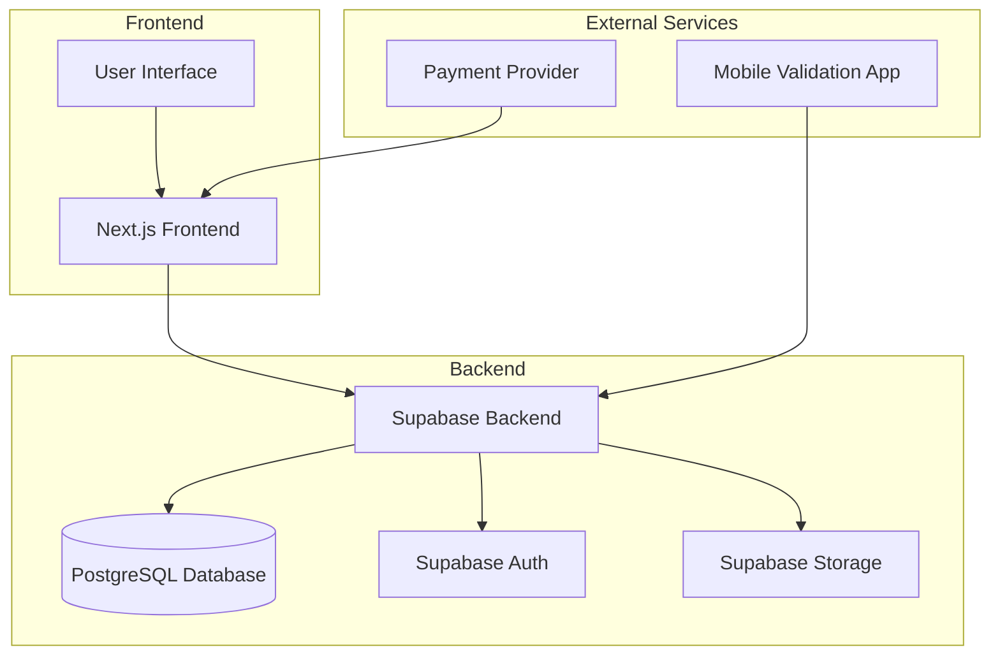
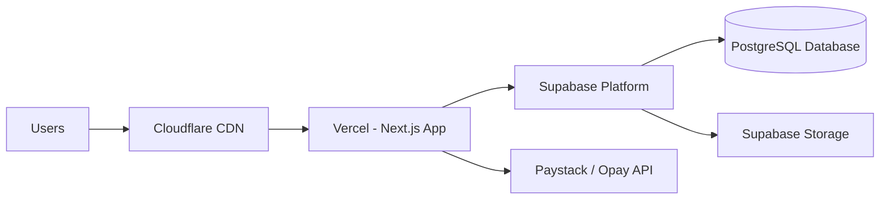

# System Architecture

## Overview

This document describes the overall system architecture for the Ticketa event ticketing platform.

## High-Level Architecture Diagram

## Component Details

### 1. Next.js Frontend

- Built with React and TypeScript
- Server-side rendering for better SEO
- Responsive design for all device sizes
- Component-based architecture

### 2. Supabase Backend

- Authentication service
- Database management
- File storage
- Real-time subscriptions

### 3. PostgreSQL Database

- User profiles and authentication
- Event and ticket data
- Payment records
- Validation logs

### 4. Supabase Auth

- User registration and login
- OAuth integration
- Session management
- Role-based access control

### 5. Supabase Storage

- Event banner images
- Ticket QR codes
- User profile pictures

### 6. Payment Provider

- Paystack / Opay for payment processing
- Secure payment handling
- Webhook integration

### 7. Mobile Validation App

- QR code scanning
- Offline validation capabilities
- Check-in tracking

## Data Flow

### User Registration

1. User signs up through frontend
2. Supabase Auth creates user account
3. Profile record created in database
4. Welcome email sent

### Event Creation

1. Event creator fills event form
2. Data validated on frontend
3. Event data sent to Supabase
4. Banner image uploaded to Storage
5. Event record created in database

### Ticket Purchase

1. User selects event and tickets
2. Payment initiated through Paystack / Opay
3. Payment processed and confirmed
4. Ticket records created in database
5. QR codes generated and stored
6. Confirmation sent to user

### Ticket Validation

1. Event staff scans QR code
2. Validation request sent to backend
3. Ticket authenticity verified
4. Check-in status updated
5. Validation result returned

## Security Considerations

### Authentication

- JWT-based session management
- Role-based access control
- Secure password handling

### Data Protection

- HTTPS encryption for all communications
- Database access controls
- File access policies

### Payment Security

- PCI DSS compliant payment processing
- No raw card data storage
- Secure webhook validation

## Scalability Considerations

### Database

- Proper indexing for performance
- Connection pooling
- Read replicas for high-traffic queries

### Storage

- CDN integration for image delivery
- Efficient file organization
- Automatic cleanup of unused files

### Caching

- Redis for session caching
- CDN for static assets
- Database query caching

## Deployment Architecture

